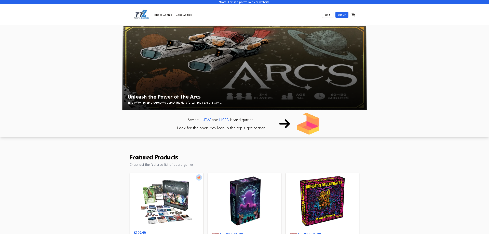

<h1>Tabletop Zealots</h1>

## Table of Contents

- [Table of Contents](#table-of-contents)
- [Overview](#overview)
- [Built With](#built-with)
- [Purpose](#purpose)
- [Contact](#contact)

## Overview

Link to website - [Tabletop Zealots](https://board-games-store-kappa.vercel.app/)

Tabletop Zealots is an e-commerce website that "sells" board games, card games, game books, and comics. The website is built using React, Next.js, and Tailwind CSS. The backend is built using .Net Core 8 and is hosted on Azure. The frontend is hosted on Vercel. The goal of this project was to create an e-commerce website that had many of the features you see in any professional e-commerce website. This includes having a catalog of products that is easy to navigate and has a filtering system, a shopping cart that is updated on the fly, a multi-step checkout process, the ability to update their profile settings, delete their account, and a payment system.

Things I want to add in the future are: testing with Vitest, a shipping tracker like ShipStation, a global search bar in the navigation bar, and a wishlist or maybe holding items in the cart for a certain amount of time.

What I learned from this project was a lot. I continued my learning of Next.js/React and really tried out a lot of cool features. I played with intercepting routes of products, which was neat, but ultimately didn't really provide as much benefit as I was initially thinking it would. There were also charts and a search bar that ended being cut as well because it just didn't come together as well as I had planned. I wanted to keep the website clean and appealing to customers, so I went with a minimalistic approach. I continue to use TailwindCss and Shadcn UI because of the ease of use and professional looking components. I have limited amount of experience with backend systems, so diving into .Net Core 8 and Azure were very beneficial to understanding how a backend system works in conjunction with a frontend. I used Identity in .Net Core to help with authentication and Entity to help with mapping to my backend database. The last major hurtle was deploying the backend to Azure. I had to learn how to deploy a .Net Core application to Azure and how to set up the database on Azure. This was a huge learning curve and a lot of trial and error on my part. I first decided I wanted to do a docker application, but had major troubles getting my Azure to read my AppSettings.json file even though it was being copied over. I ultimately decided to deploy using github actions without docker and it worked a lot better. Overall, I am pleased with the outcome of this project and I am excited to continue to learn and grow as a developer.

## Built With

- [React](https://reactjs.org/)
- [Next.js](https://nextjs.org/)
- [Tailwind](https://tailwindcss.com/)
- [Frontend Hosted on Vercel](https://vercel.com/)
- [.Net Core 8](https://dotnet.microsoft.com/)
- [Backend Hosted on Azure](https://azure.microsoft.com/en-us/)

## Purpose

The purpose of this project was to create a fully functioning e-commerce website that sells board games, card games, game books, and comics. The design was to be responsive, user-friendly, visually appealing, and minimalistic.

## Contact

- [Github](https://github.com/MCervone14)
- [My Portfolio](https://github.com/MCervone14/Portfolio-Website)
